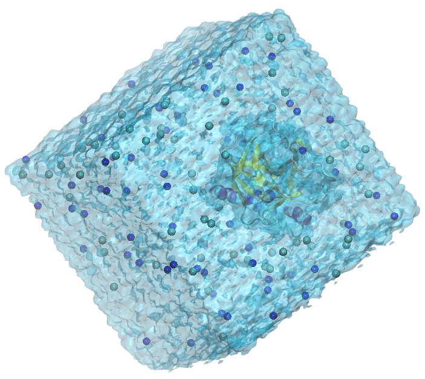

# Criar imagens e videos de dinâmicas moleculares

> O objetivo deste tutorial é criar imagens e video com qualidade para publicações a partir da dinâmica molecular da tripsina pancreática bovina.
>
> Explore, colabore e estude! 😄 Dúvidas: [patrick.faustino@unesp.br](mailto:patrick.faustino@unesp.br)

## 📖 Índice

- [Representação gráfica no VMD](#representacao-grafica-no-vmd)
- [Visualização de trajetória no VMD](#visualizacao-de-trajetoria-no-vmd)
- [Criar video da dinâmica molecular com VMD](#criar-video-da-dinamica-molecular-com-vmd)

## Representação gráfica no VMD
O [VMD](https://www.ks.uiuc.edu/Development/Download/download.cgi?PackageName=VMD) permite visualizar moléculas e realizar análises. Para instalação, verifique este repositório.

Para carregar o arquivo de coordenadas no VMD:
```bash
vmd md_5ns.gro
```

No menu do VMD, podemos realizar algumas melhorias na visualização:
```
Display > Orthographic    # para alterar a visão referencial
Display > Axes > Off    # para remover o eixo axial do painel de visualização
Display > Rendermode > GLSL    # para alterar o motor de renderização
Graphics > Colors > Display > Background > 8 white    # altera a cor do plano de fundo
```

Para modificar a forma de representação das moléculas:
```
Graphics > Representations
```

Na janela que abrir, vamos criar representações para `protein`, `water`, `resname NA` e `resname CL` utilizando o botão **Create Rep**, e realizar as seguintes configurações:
```
Selected Atoms: protein; Coloring Method: Secundary Structure; Drawing Method: NewCartoon; Material: EdgyShiny
Selected Atoms: water; Coloring Method: ColorId - 22 cyan3; Drawing Method: QuickSurf; Material: Transparent
Selected Atoms: resname NA; Coloring Method: Name; Drawing Method: VDW; Material: EdgyShiny
Selected Atoms: resname CL; Coloring Method: Name; Drawing Method: VDW; Material: EdgyShiny
```

<div align="center">

</div>

>PDB 1S0Q, Tripsina Pancreática Bovina. O VMD (*Visual Molecular Dynamics*) possui esquema de cores para estruturas de biomoléculas: 🟣 violeta para alfa-hélices; 🟡 amarelo para beta-folhas; 🔵 azul para Hélices 3-10; 🔵 ciano para voltas e ⚪ branco para novelos ou cordas.

!!! tip

    Na janela Graphics > Representations... é possivel desativar ou ativar a visualização da representação com clique duplo sobre a molécula desejada.


Para renderizar em arquivo de imagem:
```
File > Render > Start Rendering
```
É possivel alterar o motor de renderização para `Tachyon (internal, in-memory rendering)` e renomear o arquivo juntamente com a extensão `.png` ou `.jpg`.


## Visualização de trajetória no VMD
!!! note

    Após finalização da etapa de produção, é necessário ajustar as trajetórias `.xtc` ou `.trr` para a devida visualização no VMD. Esse procedimento não altera a dinâmica molecular.


Para ajustar a trajetória no Gromacs:
```bash
gmx trjconv -f md_5ns.xtc -s md_5ns.tpr -o md_noPBC.xtc -pbc mol -center -ur compact

# -pbc = mol, para visualizar as moléculas inteiras.
# -center = centraliza a proteina na caixa.
# -ur = compact, para uma visualização compacta na caixa.
```

Quando solicitado, selecione `1 Protein` para indicar que a proteina deverá ser centralizada na caixa e `0 System` para solicitar que todo o sistema esteja no arquivo de saida **md_noPBC.xtc**.

!!! note

    Saiba mais sobre [trjconv](https://manual.gromacs.org/current/onlinehelp/gmx-trjconv.html).


Para carregar as coordenadas e trajetória no VMD:
```bash
vmd md_5ns.gro md_noPBC.xtc
```

## Criar video da dinâmica molecular com VMD
Link para visualizar o video demonstrativo da dinâmica: [https://youtu.be/IQGiznRc0Xo](https://youtu.be/IQGiznRc0Xo).

!!! note

    Crie uma pasta para salvar os snapshots de cada frame.


Para criar o video, inicialmente instale as bibliotecas:
```bash
sudo apt install netpbm ffmpeg
```

No VMD, após ajustes nas visualizações e carregar os arquivos de coordenadas e trajetória, crie snapshots para cada frame:

```
Extensions > Visualization > Movie Maker
```

Na janela que abrir, selecione a pasta onde os snapshots serão salvos. Certifique que:
- `Name of movie: untitled`
- `Rotation angle=0`
- `Trajectory step size=1`
- `Movie duration (s)=0`

No menu `Renderer`, selecione `Snapshot` ou `Internal Tachyon`. Em `Movie Settings`, selecione `Trajectory` e desabilite a opção `4: Delete image files`. Em `Format`, selecione `MPEG-1`. Clique em Make Movie.

Na pasta onde estão os snapshots, crie o video:
```bash
ffmpeg -framerate 30 -i untitled.%05d.ppm -vf scale=1920:-2:flags=lanczos -c:v libx265 -crf 18 -preset slow movie.mkv
```

O video será salvo como `movie.mkv` e pode ser hospedado no YouTube ou qualquer serviço de hospedagem.

---

### 🧪⚗️ *Boas simulações moleculares!* 🦠🧬

---

## 📜 Como citar

FAUSTINO, P. A. S. *Documentação sobre Química Biofísica Computacional*. [S. l.]: Zenodo, 2026. DOI 10.5281/zenodo.22729510. Disponível em: <https://doi.org/10.5281/zenodo.22729510>.
