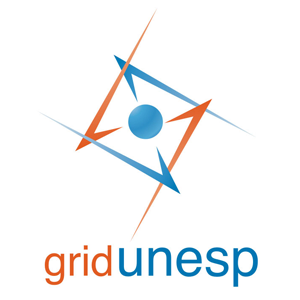

# Dinâmica Molecular utilizando gridUNESP

!!! info "Testado em"

    - Ambiente: contêiner Apptainer (Ubuntu 24.04 + CUDA 12.9.1)
    - GROMACS: 2026.2
    - CUDA: 12 (sm_89)


<div align="center">
    
</div>

!!! note "Dica:"
    Antes de começar leia a documentação do [gridUNESP](https://www.ncc.unesp.br/gridunesp/docs/v3/pt_BR/index.html).

## :lucide-container: Criando o container com Apptainer

A técnica de contêineres com Apptainer, docker e outros softwares busca criar imagens e ambientes de sistemas com bibliotecas instaladas o qual o processamento é feito dentro do contêiner que se comunica com o host principal.

Para criar um contêiner, precisamos de dois arquivos:

- [gromacs-gpu.def](../assets/instalacao/gridunesp/gromacs-gpu.def): arquivo com as instruções para criar o contêiner.
- [build.sh](../assets/instalacao/gridunesp/build.sh): script para enviar a tarefa de criação do contêiner para o gridUNESP.

Acesse o gridUNESp, envie o arquivo `gromacs-gpu.def` e `build.sh` para o diretório de trabalho e execute o script `build.sh`.
```bash
sbatch build.sh
```

!!! warning

    Mantenha sempre uma versão <= CUDA do contêiner em relação ao CUDA instalado no gridUNESP.

!!! tip "Dica:"

    Faça o download e backup do arquivo `gromacs-gpu.sif`. Esse arquivo é o contêiner criado e pode ser utilizado em qualquer computador compatível.


---
## :lucide-play: Dinâmicas moleculares no contêiner

Para a dinâmica, utilize os arquivos de exemplo [md1.sh](../assets/instalacao/gridunesp/md1.sh) e [run1.sh](../assets/instalacao/gridunesp/run1.sh).

```bash
sbatch run1.sh
```

---
## :lucide-lightbulb: Dicas para gridUNESP

```bash
ssh usuario@access.grid.unesp.br        # para acesso

squeue -u usuario                       # lista tarefas do usuario
squeue -a                               # lista todas as tarefas do grid

sbatch job.sh                           # submete a tarefa
scancel 00000000                        # cancela a tarefa, onde 00000000 é o numero atribuido a tarefa
scontrol show job 00000000              # verifica detalhes da tarefa

sshare -a | grep usuario                # verifica o FairShare, quanto maior for, maior a prioridade.

squeue -o "%.18i %.9Q %.8j %.8u %.10V %.6D %R" --sort=-p,i --states=PD    # verifica a fila das próximas tarefas

tail -f slurm-00000000.out    # acompanha o processamento da tarefa

sinfo -p gpu -o "%.10P %.5a %.10l %.6D %.6t %.8C %.8m %.25G"        # obter informações dos nós com GPU
sinfo -t idle        # nós que estão disponíveis.

```

---
## :lucide-quote: Como citar

FAUSTINO, P. A. S. *Documentação sobre Química Biofísica Computacional*. [S. l.]: Zenodo, 2026. DOI 10.5281/zenodo.22729510. Disponível em: <https://doi.org/10.5281/zenodo.22729510>.
