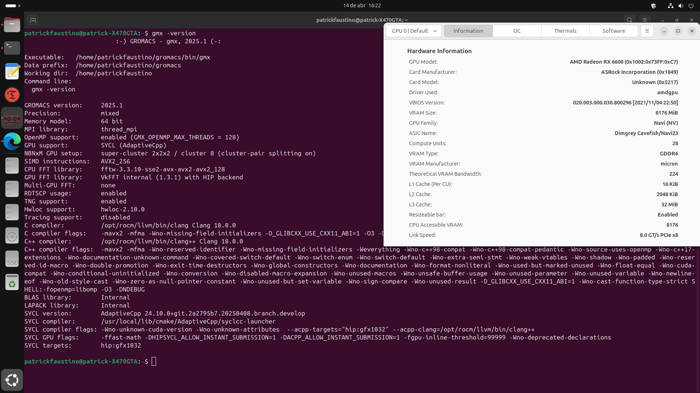

# Workflow de Instalação Gromacs 2026.x com ROCm 6.x no Ubuntu 24.04 Noble Numbat

!!! info "Testado em"

    - Distro: Ubuntu 24.04.4 (kernel 6.8)
    - GROMACS: 2026.0
    - ROCm: 6.4
    - Data: *a confirmar*



> Tutorial para compilar o GROMACS 2026.0 com suporte NNPOT-PyTorch (Redes Neurais) em GPU, utilizando ROCm 6.4 (AdaptiveCpp 25.x como opcional) no Ubuntu 24.04.4 Kernel 6.8.

## :lucide-laptop: Computador testado e pré-requisitos:
- CPU Ryzen 7 2700X, Memória 2x16 GB DDR4, Chipset X470, GPU ASRock RX 6600 8 GB e Ubuntu 24.04.

Antes de começar, verifique se você atendeu aos seguintes requisitos:

- Você tem uma máquina linux `Ubuntu 24.04` com instalação limpa e atualizado.
- Você tem uma GPU série `AMD RDNA2`. Testado com arquiteturas `RDNA3`.
- Documentações [ROCm 6.4](https://rocm.docs.amd.com/projects/install-on-linux/en/docs-6.4.3/index.html), [AdaptiveCpp 25.xx](https://github.com/AdaptiveCpp/AdaptiveCpp) e [GROMACS 2026.x](https://manual.gromacs.org/current/index.html).

Você vai precisar atualizar e instalar pacotes em sua máquina:
```bash
sudo apt update && sudo apt upgrade
sudo apt autoremove && sudo apt autoclean
sudo apt install build-essential libboost-all-dev git cmake cmake-curses-gui ttf-mscorefonts-installer
```

Para adicionar ferramentas necessárias ou atualizar com versões mais recentes:
```bash
sudo add-apt-repository ppa:ubuntu-toolchain-r/test
sudo apt update && sudo apt upgrade
```

Verifique também a versão do kernel (:lucide-triangle-alert: versão = 6.8):
```bash
uname -r
cat /etc/os-release
cmake --version
g++ --version
ldd --version
```

Verifique seu diretorio padrão `$HOME`, pois será o caminho utilizado para a maioria das instalações e configurações. Explore!

!!! tip

    Para instalar o Kernel 6.8 GA (recomendado):
    ```bash
    sudo apt install linux-image-generic
    ```

    Para remover kernel antigos incompatíveis:
    ```bash
    dpkg --list | egrep -i --color 'linux-image|linux-headers'
    ```


---
## :lucide-wrench: Instalando Timeshif

O [Timeshift](https://www.edivaldobrito.com.br/como-instalar-o-timeshift-no-ubuntu-linux-e-derivados/) é um software para criar backups. Recomendamos que seja criados backups para cada etapa completa. Para instalar o `Timeshift`, siga estas etapas:
```bash
sudo add-apt-repository ppa:teejee2008/timeshift
sudo apt update
sudo apt install timeshift
```

!!! tip

    Se desejar, instale o [GRUB CUSTOMIZER](https://www.edivaldobrito.com.br/grub-customizer-no-ubuntu/) para gerenciar o inicializador e [MAINLINE](https://www.edivaldobrito.com.br/como-instalar-o-ubuntu-mainline-kernel-installer-no-ubuntu-e-derivados/) para gerenciar o kernel instalado.

    ```bash
    sudo add-apt-repository ppa:danielrichter2007/grub-customizer
    sudo apt update
    sudo apt install grub-customizer
    ```

    ```bash
    sudo add-apt-repository ppa:cappelikan/ppa
    sudo apt update
    sudo apt install mainline
    ```


---
## :lucide-search: Instalando ROCm 6.x

Recomenda-se realizar todas as instalações na pasta `Downloads`. Vamos instalar o [ROCm 6.4](https://rocm.docs.amd.com/projects/install-on-linux/en/docs-6.4.3/install/install-methods/amdgpu-installer/amdgpu-installer-ubuntu.html).
```bash
cd $HOME/Downloads
sudo apt install "linux-headers-$(uname -r)" "linux-modules-extra-$(uname -r)"
sudo apt install python3-setuptools python3-wheel
wget https://repo.radeon.com/amdgpu-install/6.4.3/ubuntu/noble/amdgpu-install_6.4.60403-1_all.deb
sudo apt install ./amdgpu-install_6.4.60403-1_all.deb
sudo apt update
sudo amdgpu-install --usecase=rocm,rocmdev,hip,hiplibsdk,openmpsdk,mllib,mlsdk
sudo usermod -a -G render,video $LOGNAME
```
```bash
echo 'ADD_EXTRA_GROUPS=1' | sudo tee -a /etc/adduser.conf
echo 'EXTRA_GROUPS=video' | sudo tee -a /etc/adduser.conf
echo 'EXTRA_GROUPS=render' | sudo tee -a /etc/adduser.conf
```
```bash
reboot
```

Para verificar a instalação, utilize:
```bash
groups
sudo clinfo
sudo rocminfo
sudo rocm-smi
/opt/rocm/bin/hipconfig --full
```

!!! warning

    Quando printar `rocminfo`, verificar o nome da placa que será apresentado como `gfx1032` (para RX 6600).


Pode ser necessário a instalação da biblioteca `rocm-llvm-dev`:
```bash
sudo apt install rocm-llvm-dev
```

A GPU deverá ser identificada nas informações. Caso não consiga, experimente `reboot` e verifique novamente. A instalação ficará em `/opt/rocm`.

!!! tip

    Utilize o comando abaixo para listar todos `cases` disponíveis no `amdgpu-install` para instalação:

    ```bash
    sudo amdgpu-install --list-usecase
    ```

    Para remover `amdgpu-install`, utilize:

    ```bash
    sudo amdgpu-install --uninstall --rocmrelease=all
    sudo apt purge amdgpu-install && sudo apt autoremove && sudo apt autoclean
    ```
    ```bash
    sudo rm /etc/apt/sources.list.d/amdgpu.list
    sudo rm /etc/apt/sources.list.d/rocm.list
    sudo rm -rf /var/cache/apt/*
    sudo apt clean all
    sudo apt update
    sudo reboot
    ```


---
## :lucide-gauge: Instalando LACT

O aplicativo [LACT](https://github.com/ilya-zlobintsev/LACT) é utilizado para controlar e realizar overclocking em GPU AMD, Intel e Nvidia em sistemas GNU/Linux.
```bash
cd $HOME/Downloads
wget https://github.com/ilya-zlobintsev/LACT/releases/download/v0.8.4/lact-0.8.4-0.amd64.ubuntu-2404.deb
sudo dpkg -i lact-0.8.4-0.amd64.ubuntu-2404.deb
sudo systemctl enable --now lactd
```
**AMD Overclocking:** ative a função no LACT e faça um `reboot`.

!!! warning

    Faça o download do pacote [LACT](https://github.com/ilya-zlobintsev/LACT/releases/) de acordo com a distribuição do Linux.


!!! note

    Para remover versões anteriores, utilize `sudo dpkg -r lact`.


---
## :lucide-thermometer: Instalando Hardware Sensors Indicator

O aplicativo [HSI](https://github.com/alexmurray/indicator-sensors) é utilizado para monitorar a temperatura de CPU, GPU, Motherboard, etc. Recomenda-se a instalação pela Central de Aplicativos [Snap](https://snapcraft.io/indicator-sensors) do Ubuntu e configurar para inicialização automatica com monitoramento da CPU (Tctl).
```bash
sudo snap install indicator-sensors
```

---

## :lucide-hammer: Instalando AdaptiveCpp 25.x (opcional)

O [AdaptiveCpp 25.x](https://github.com/AdaptiveCpp/AdaptiveCpp) irá trabalhar em backend com `rocm`. Recomenda-se o uso da pasta `Downloads`. Para instalar:

```bash
cd $HOME/Downloads
git clone https://github.com/AdaptiveCpp/AdaptiveCpp
cd AdaptiveCpp
sudo mkdir build && cd build
```

Para compilar com CMake (versão >=3.28):
```bash
sudo cmake .. \
-DCMAKE_INSTALL_PREFIX=/usr/local \
-DCMAKE_C_COMPILER=/opt/rocm/llvm/bin/clang \
-DCMAKE_CXX_COMPILER=/opt/rocm/llvm/bin/clang++ \
-DLLVM_DIR=/opt/rocm/llvm/lib/cmake/llvm/ \
-DWITH_ROCM_BACKEND=ON \
-DWITH_SSCP_COMPILER=OFF \
-DWITH_OPENCL_BACKEND=OFF \
-DWITH_LEVEL_ZERO_BACKEND=OFF \
-DWITH_CUDA_BACKEND=OFF \
-DDEFAULT_TARGETS='hip:gfx1032'
```
```bash
sudo make install -j$(nproc)
```

Para verificar a instalação, `acpp-info` e `acpp --version` deverá apresentar as informações da GPU:
```bash
acpp-info
acpp --version
```

!!! note

    **Meu Caso**: Utilizando `j$(nproc)`, define a quantidade de CPUs utilizadas na compilação. Pode ser omitido `-j$(nproc)`.


!!! warning

    Sempre fique atento aos caminhos dos diretórios, *i.e* `/path/to/user/...`, porque são os maiores causadores de erros durante as compilações.


---
## :lucide-gem: Instalação do GROMACS 2026.x

**LIBTORCH!** É possivel instalar a biblioteca [libtorch](https://pytorch.org/) para utilizar Redes Neurais. Verifique a versão mais recente. Utilize a pasta `Downloads`.
```bash
cd $HOME/Downloads
wget https://download.pytorch.org/libtorch/cpu/libtorch-shared-with-deps-2.9.0%2Bcpu.zip
unzip libtorch-shared-with-deps-2.9.0+cpu.zip
```

Podemos instalar algumas bibliotecas auxiliares para o GROMACS:
```bash
sudo apt install grace \
hwloc \
texlive \
libhdf5-dev \
hdf5-tools \
libfftw3-dev \
libopenblas-dev \
imagemagick \
libpng-dev \
libjpeg-dev \
libtiff-dev \
libxml2-dev \
libtinyxml2-dev \
libzstd-dev \
zlib1g-dev
```

A partir de agora, você poderá seguir a documentação oficial [guia de instalação](https://manual.gromacs.org/current/install-guide/index.html).
```bash
cd $HOME/Downloads
wget ftp://ftp.gromacs.org/gromacs/gromacs-2026.0.tar.gz
tar -xvf gromacs-2026.0.tar.gz
cd gromacs-2026.0
sudo mkdir build && cd build
```

Para compilar com Cmake (versão >=3.28):
```bash
sudo cmake .. \
	-DCMAKE_INSTALL_PREFIX=$HOME/gromacs-hip-torch \
	-DCMAKE_C_COMPILER=/opt/rocm/bin/amdclang \
	-DCMAKE_CXX_COMPILER=/opt/rocm/bin/amdclang++ \
	-DCMAKE_HIP_COMPILER=/opt/rocm/bin/amdclang++ \
	-DGMX_GPU=HIP \
	-DGMX_HIP_TARGET_ARCH=gfx1032 \
	-DCMAKE_PREFIX_PATH="/opt/rocm;$HOME/Downloads/libtorch" \
	-DGMX_NNPOT=TORCH \
	-DGMX_BUILD_OWN_FFTW=ON \
	-DREGRESSIONTEST_DOWNLOAD=ON \
	-DGMX_HWLOC=ON \
	-DGMX_USE_PLUMED=ON \
	-DGMX_USE_HDF5=ON \
	-DGMX_USE_COLVARS=INTERNAL \
	-DGMX_EXTERNAL_TINYXML2=ON \
	-DGMX_EXTERNAL_ZLIB=ON
```

Note que criei uma pasta chamada `gromacs-acpp-torch` para os arquivos compilados e indiquei com `-DCMAKE_INSTALL_PREFIX`, pois isso facilita a atualização do GROMACS no futuro.

!!! note

    **Meu Caso**: Atenção ao `-DHIPSYCL_TARGETS='hip:gfxABC'`, substitua com seus valores para a GPU.


Agora é o momento de compilar, checar e instalar:
```bash
sudo make -j$(nproc)
sudo make check -j$(nproc)
sudo make install -j$(nproc)
```

Para carregar a biblioteca e invocar o GROMACS:
```bash
source $HOME/gromacs-hip-torch/bin/GMXRC
gmx -version
```

!!! tip

    Você poderá editar o arquivo `$HOME/.bashrc` e adicionar o código `source $HOME/gromacs-hip-torch/bin/GMXRC`. Assim, toda vez que abrir o terminal carregara o GROMACS.


!!! note

    ***Extra:*** para compilar com suporte AdaptiveCpp e Torch (CPU):
    ```bash
    sudo cmake .. \
    -DGMX_BUILD_OWN_FFTW=ON \
    -DREGRESSIONTEST_DOWNLOAD=ON \
    -DCMAKE_C_COMPILER=/opt/rocm/llvm/bin/clang \
    -DCMAKE_CXX_COMPILER=/opt/rocm/llvm/bin/clang++ \
    -DGMX_GPU=SYCL \
    -DGMX_SYCL=ACPP \
    -DCMAKE_INSTALL_PREFIX=$HOME/gromacs-acpp-torch \
    -DHIPSYCL_TARGETS='hip:gfx1032' \
    -DGMX_HWLOC=ON \
    -DGMX_USE_HDF5=ON \
    -DGMX_USE_PLUMED=ON \
    -DGMX_NNPOT=TORCH \
    -DCMAKE_PREFIX_PATH="$HOME/Downloads/libtorch" \
    -DGMX_USE_COLVARS=INTERNAL \
    -DGMX_EXTERNAL_TINYXML2=ON \
    -DGMX_EXTERNAL_ZLIB=ON
    ```


---
## :simple-python: Instalando ANACONDA e PyTorch

O [Anaconda](https://www.anaconda.com) é um importante pacote de bibliotecas Python voltados para o uso científico.
```bash
cd $HOME/Downloads
wget https://repo.anaconda.com/archive/Anaconda3-2025.12-2-Linux-x86_64.sh
bash Anaconda3-2025.12-2-Linux-x86_64.sh
source ~/.bashrc
conda config --set auto_activate_base false
conda info
```

Com os comandos acima será carregado no prompt (`source ~/.bashrc`) o conda `base`. Para desativar o carregamento automatico, utilizar `conda config --set auto_activate_base false`.

!!! tip

    Faça o download do pacote [Anaconda](https://www.anaconda.com/download) mais recente.


!!! warning

    Certifique de que a instalação será no diretório `$HOME/anaconda3` confirmando `yes` para todas as respostas. **NÃO UTILIZE `sudo`**.


Agora, vamos criar um ambiente virtual e instalar o [Pytorch](https://pytorch.org/get-started/locally/). No diretório `$HOME`, crie um ambiente `gromacs-nnpot`:
```bash
cd $HOME
sudo apt install python3-venv libjpeg-dev python3-dev python3-pip
python3 -m venv gromacs-nnpot
source $HOME/gromacs-nnpot/bin/activate
pip install torch==2.8.0 torchvision==0.23.0 torchaudio==2.8.0 --index-url https://download.pytorch.org/whl/rocm6.4
pip3 install torchani mace-torch
```

Para testar:
```bash
python3 -c 'import torch' 2> /dev/null && echo 'Success' || echo 'Failure' # retorna Success
python3 -c "import torch; print(torch.cuda.is_available())"                # retorna True
python3 -c "import torch; print(torch.cuda.get_device_properties(0))"      # retorna informações GPU
python3 -c "import torch; x = torch.rand(5, 3); print(x)"                  # retorna matriz
python3 -c "import torch; print(torch.__version__)"                        # retorna a versão do Torch
```

!!! tip

    Caso deseje desistalar utilize `pip3 uninstall <biblioteca>`, para atualizar `pip3 install --upgrade <biblioteca>` e para listar os pacotes instalados `pip3 list`.


---

## :lucide-gem: Instalação do OpenMM 8.x

O [OpenMM](https://openmm.org/) é outro software baseado em Python para simulação de dinâmica molecular. Para sua instalação, vamos criar um ambiente virtual e instalar via pip no diretório padrão `$HOME`.
```bash
cd $HOME
python3 -m venv openmm
source $HOME/openmm/bin/activate
pip3 install openmm[hip6]
```

Para sair do ambiente criado, basta utilizar `deactivate`. Para verificar a instalação, onde será realizado teste com a Referência, CPU, HIP e OpenCL:
```bash
python -m openmm.testInstallation
```

!!! note

    ***Extra:*** para compilar no Conda com suporte Torch:
    ```bash
    conda create --name openmm-conda
    conda activate openmm-conda
    conda install -c conda-forge openmm-hip openmmforcefields openmm-torch openmm-ml
    ```


Para remover o ambiente conda criado `conda env remove --name openmm-conda` e para listar todas os ambientes utilize `conda env list`.

---
## :lucide-dna: Instalando VMD e Pymol

O [VMD](https://www.ks.uiuc.edu/Development/Download/download.cgi?PackageName=VMD) permite visualizar moléculas e realizar análises. Para instalação:
```bash
cd $HOME
wget https://www.ks.uiuc.edu/Research/vmd/alpha/vmd-2.0.0a9.bin.LINUXAMD64.tar.gz
tar xvzf vmd-2.0.0a9.bin.LINUXAMD64.tar.gz
cd  vmd-2.0.0a9
./configure
cd src
sudo make install -j$(nproc)
vmd
```

O [Pymol](https://www.pymol.org/) é outro software muito utilizado para visualização de moléculas:
```bash
sudo snap install pymol-oss
```

---
## :lucide-calculator: Instalando o Julia

O [Julia](https://julialang.org/) é uma linguagem de programação voltada para cálculos científicos, similar ao Python. Para instalar:

```bash
cd $HOME
sudo apt install curl
curl -fsSL https://install.julialang.org | sh
```

Para atualizar, utilize no terminal `juliaup update`.

---

*PARA DEMAIS FERRAMENTAS, CONSULTE O WORKFLOW PARA NVIDIA CUDA*

---

### :lucide-flask-conical: *Boas simulações moleculares!*

---
## :lucide-book-open: Leitura complementar

- [Install workflow with AMD GPU support (Framework 16, Ubuntu 24.04, GPU: AMD Radeon RX 7700S)](https://gromacs.bioexcel.eu/t/install-workflow-with-amd-gpu-support-framework-16-ubuntu-24-04-gpu-amd-radeon-rx-7700s/10870)

## :lucide-quote: Como citar

FAUSTINO, P. A. S. *Documentação sobre Química Biofísica Computacional*. [S. l.]: Zenodo, 2026. DOI 10.5281/zenodo.22729510. Disponível em: <https://doi.org/10.5281/zenodo.22729510>.
