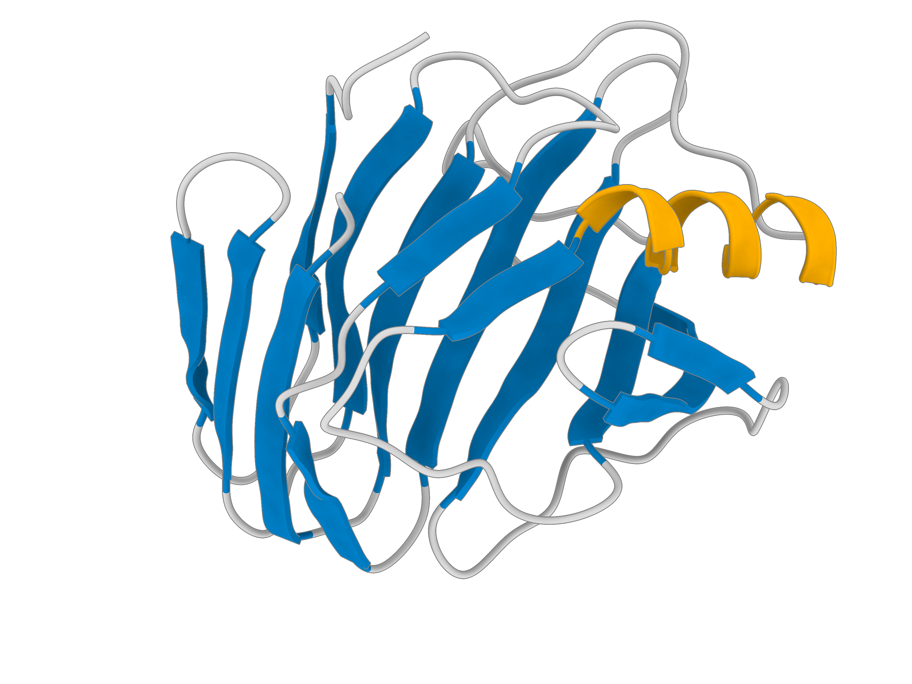

    

## :lucide-graduation-cap: About Me { #about-me }
- PhD candidate in Biotechnology at the Paulista State University, Brazil.
- MSc in Biomaterials and Bioprocess Engineering at the Paulista State University, Brazil.
- Computer Engineering student, Virtual University of the State of São Paulo, Brazil.
- Bachelor's degree in Chemistry and Biological Sciences, Federal University of Minas Gerais, Brazil.
- Research Programs in Aerospace Technologies in the ​​Biotechnology at the Hardware BR Institute, Brazil.
- Working on Computational Biophysical Chemistry, specifically Molecular Dynamics Simulations applying in the area of ​​thermodynamics properties of biomolecules.
- Research on the behavior of biomolecules in ionic liquids.
- Investigation of enzymatic decarboxylation for the production of drop-in bio-hydrocarbons, using Molecular Dynamics for thermodynamic property.
- I welcome discussions, consultations and collaboration opportunities in the areas of computational chemistry and molecular dynamics simulations. Feel free to contact me or if you would like to discuss possible cooperations.

## :lucide-mail: Contact { #contact }
- Email: [patrick.faustino@unesp.br](mailto:patrick.faustino@unesp.br)
- X: [@pkfaustino](https://x.com/pkfaustino)
- ORCID: [0000-0002-9323-2489](https://orcid.org/0000-0002-9323-2489)

## :lucide-flask-conical: Computational Biophysical Chemistry Research Group { #computational-biophysical-chemistry-research-group }
​The Computational Biophysical Chemistry Research Group operates at the interface between Physical Chemistry/Thermodynamics and Biochemistry, investigating — through Molecular Dynamics simulations, free energy methods, and polarizable force fields — the molecular mechanisms that govern the behavior of proteins, enzymes, and complex solvents.

Keywords: Computational Biophysical Chemistry; Molecular Dynamics Simulation; Biomolecular Thermodynamics; Free Energy Methods; Aqueous Two-Phase Systems; Ionic Liquids; Kirkwood–Buff Theory; Computational Biocatalysis; Sustainable Aviation Fuel (SAF); Fatty Acid Decarboxylases.

CNPq Brazil areas: Exact and Earth Sciences > Chemistry > Physical Chemistry > Molecular Thermodynamics / Computational Biophysical Chemistry

## :lucide-monitor: Workstation Home { #workstation-home }
- AMD Ryzen 9 5900XT (16/32) @ OC 4300 MHz with Water-Cooler 360 Kalkan and Corsair 4000D computer case; ASUS TUF Gaming X570 Plus; Corsair Dominator 2x16 GB DDR4 @ 3200 MT/s XMP2; MSI RTX 4070 Ti Gaming Trio X; Power Supply Energy Corsair RM1000e 1000 W.
- AMD Ryzen 7 2700X (8/16) @ OC 3400 MHz with Water-Cooler 240 Rise and Gamemax Fortress computer case; Biostar Racing X470GTA; Geil 2x16 GB DDR4 @ 3000 MT/s XMP2; AsRock RX 6600XT Challenger D; Power Supply Energy AeroCool KCAS 500 W.
- 51.4 TFLOPS Go!
- Software suite molecular dynamics: Gromacs 2026.x and OpenMM 8.x

## :lucide-book-open: Publicações { #publicacoes }
- Dissertação de Mestrado: [Dinâmica molecular da lipase em sistemas aquosos bifásicos baseados em líquidos iônicos](https://hdl.handle.net/11449/314012)
- Seminário de Doutorado: [Simulação de Biomoléculas: dinâmica molecular básica](https://github.com/patrickallanfaustino/tutorials-md/blob/main/seminario_dm.pdf)

## :lucide-wrench: Skills { #skills }

## :lucide-quote: Como citar { #como-citar }

Se este material foi útil para sua pesquisa ou estudo, cite conforme abaixo (veja também o [CITATION.cff](https://github.com/patrickallanfaustino/patrickallanfaustino.github.io/blob/main/CITATION.cff) do repositório):

FAUSTINO, P. A. S. *Documentação sobre Química Biofísica Computacional*. [S. l.]: Zenodo, 2026. DOI 10.5281/zenodo.22729510. Disponível em: <https://doi.org/10.5281/zenodo.22729510>.

## :lucide-scale: Licença { #licenca }

Este conteúdo está licenciado sob [CC BY 4.0](https://github.com/patrickallanfaustino/patrickallanfaustino.github.io/blob/main/LICENSE) (Creative Commons Attribution 4.0 International): você pode compartilhar e adaptar o material para qualquer fim, inclusive comercial, desde que dê o devido crédito.
